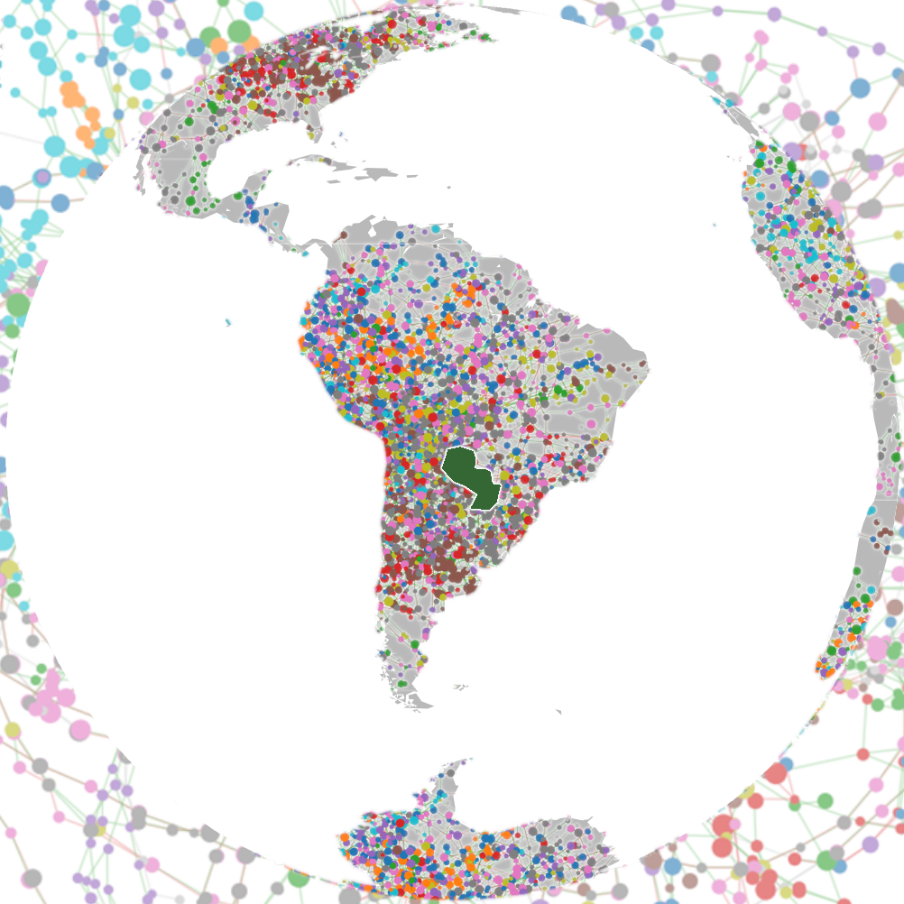

# ParaGVAE 

Graph convolutional binning on MetaMetro coloured graph tensors.

[](VERSION)
[](https://github.com/dsmutin/ParaGVAE/actions/workflows/required-tests.yml)
[](https://github.com/dsmutin/ParaGVAE/actions/workflows/full-tests.yml)
[](LICENSE)

ParaGVAE asks which modelling choices improve metagenomic binning on a MetaMetro coloured graph tensor (CGT). It trains a graph convolutional network on that sparse tensor, clusters the embedding into bins, and scores the bins. Each check changes one factor: feature source, loss, colour channels, graph type, local graph statistics, or the clusterer.

Documentation of the checks lives on the [wiki](https://github.com/dsmutin/ParaGVAE/wiki).

## How it works

1. Load an assembly as a CGT. Topology stays a SciPy CSR matrix (`indptr`, `indices`). Node features are a frozen VAE latent or raw k-mer and depth. Discrete colours, when that arm asks for them, are extra `uint8` channels. Genome labels are used only to choose `k` and to score; they are not features and they do not enter the loss.
2. Train a 2-layer GCN in `cpp/gcn_train`. One fifth of the undirected edges are held out and removed from the propagation operator. Training stops early (learning rate 0.05, at most 60 epochs, patience 8, from `configs/datasets.yaml`).
3. Cluster the embedding. The default is k-means. The clustering check also runs average-linkage agglomerative clustering. `k` is the number of ground-truth genomes and is the same for every arm of a check.
4. Score contig F1 and adjusted Rand index. A separate stage writes AMBER `f1_score_seq` (`amber_f1`) on the same bins. VAMB is not rerun.

```text
configs/datasets.yaml
        → CGT (CSR; colours in uint8)
        → cpp/gcn_train
        → k-means, or average linkage when that arm says so
        → benchmark/<hypothesis>/{results.csv,summary.csv,f1.html}
```

## Install

Conda is the supported install:

```bash
conda env create -f environment.yml
conda activate paragvae
```

`environment.yml` sets `PYTHONPATH=src` and pins Python 3.12. The C++ trainer is compiled on first use.

## Usage

One hypothesis (seeds 0 and 1):

```bash
python research/run_hypothesis.py feature_source
```

All six:

```bash
python research/run_all.py
```

| Folder | Question |
|--------|----------|
| `research/feature_source` | Frozen VAE latent versus raw k-mer and depth |
| `research/loss` | Edge BCE, marker push, or InfoNCE |
| `research/coloring` | With or without CGT colour channels |
| `research/graph_type` | Assembly edges versus feature kNN |
| `research/multiscale` | Degree and local clustering, or the latent alone |
| `research/clustering` | k-means versus average-linkage |

Paths, the score definition, and the recorded means are in [docs/reproduction.md](docs/reproduction.md), [docs/metametro.md](docs/metametro.md), and [docs/findings.md](docs/findings.md). Charts are under `benchmark/`.

`paragvae --version` prints the `VERSION` file. `paragvae` writes the scaffold JSON (`status`, `ok`, `input_path`). Hypothesis runs are the scripts above.

## Tests

```bash
pytest -m mandatory    # every commit
pytest                 # mandatory and optional
```

## License

MIT. See [LICENSE](LICENSE). Development rules are in [CONTRIBUTING.md](CONTRIBUTING.md).
